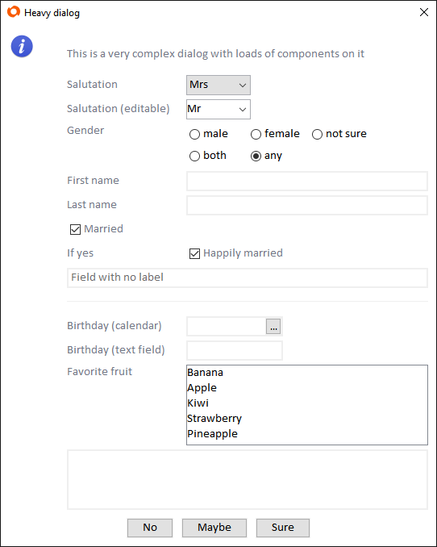
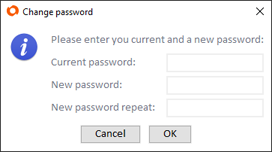

# Introduction
svyCustomDialogs is a helper scope to create simple dialogs on the fly. If you need a simple dialog to ask a user to change his password for example, svyCustomDialogs can create such a dialog with a few simple lines of code. 

It includes the functionality of Servoy's dialogs plugin or the mod_dialog from ServoyForge, which allows you to show dialogs with code continuation in the Servoy web client (your code will wait until the dialog is closed and not immediately run on).

Here is an example dialog created with svyCustomDialogs:



A dialog created by the scope consists of a simple two column layout, with labels in one column and fields in the other. A component without a label will span over both columns. 

# Creating Dialogs
To show a simple change password dialog, check out the following snippet:
```javascript
var customDialog = scopes.svyCustomDialogs.createCustomDialog(
		'myStyle',
		'Change password',
		'Please enter you current and a new password:',
		scopes.svyCustomDialogs.DEFAULT_ICON.INFO,
		['Cancel', 'OK']);
	
customDialog.addPasswordField('Current password:');
customDialog.addPasswordField('New password:');
customDialog.addPasswordField('New password repeat:');
	
customDialog.showDialog();
	
if (customDialog.buttonClickedText != 'OK') {
	return;
}
	
var result = customDialog.getResult();
	
application.output('Current password is ' + result[0]);
application.output('New password is ' + result[1]);
application.output('New password repeat is ' + result[2]);
```

The resulting dialog looks like this:



This is the code used to create the complex dialog example from above:

```javascript
var customDialog = scopes.svyCustomDialogs.createCustomDialog(
	'extensions_demo',
	'Heavy dialog',
	'<html>This is a very complex dialog with loads of components on it<br>',
	scopes.svyCustomDialogs.DEFAULT_ICON.INFO,
	['No', 'Maybe', 'Sure']);

customDialog
	.setColumnSpacing(20)
	.setDefaultFieldWidth(300);

customDialog
	.addCombobox('Salutation', ['Mr', 'Mrs'], ['Mr', 'Mrs'], 'Mrs')
	.setWidth(80);
customDialog
	.addCombobox('Salutation (editable)', ['Mr', 'Mrs'])
	.setInitialValue('Mr')
	.setWidth(80);
customDialog
	.addRadioButtonGroup('Gender', ['male', 'female', 'not sure', 'both', 'any'])
	.setInitialValue('any');
customDialog
	.addTextField('First name');
customDialog
	.addTextField('Last name');
customDialog
	.addCheckbox('Married', null, true);
customDialog
	.addCheckbox('Happily married', 'If yes', true);
customDialog
	.addTextField(null)
	.setPlaceholderText('Field with no label');
customDialog
	.addSeparator();
customDialog
	.addCalendar('Birthday (calendar)')
	.setFormat('yyyy-MM-dd')
	.setWidth(120);
customDialog
	.addTextField('Birthday (text field)', null, JSColumn.DATETIME)
	.setFormat('yyyy-MM-dd')
	.setWidth(120);
customDialog
	.addTextField('Favorite fruit')
	.setValueListItems(['Banana', 'Apple', 'Kiwi', 'Strawberry', 'Pineapple'])
	.setDisplayType(JSField.LISTBOX);
customDialog
	.addTextArea(null, null)
	.setHeight(75);

customDialog.showDialog();
```

# API overview

The API of svyCustomDialogs consists mainly of factory methods that return objects of the scope. The API is built to allow method chaining, so most property setters return the object itself to allow this kind of coding:
```javascript
customDialog
	.addCalendar('Birthday (calendar)')
	.setFormat('yyyy-MM-dd')
	.setWidth(120);
```

* `createCustomDialog([styleName], [title], [message], [icon], [buttons], [components])`

  Creates and returns a CustomDialog object using the given style, title text, message, icon, buttons and components to    add.

* factory methods to create specific components such as `createButton()`, `createTextField()` etc.

  These methods create and return a subclass of a DialogComponent object. Instead of creating and adding these objects to the custom dialog, they can be added directly to the CustomDialog object via component specific methods such as `addTextField().`

* dialogs plugin replacement methods such as `showInfoDialog()`

  These methods can replace Servoy's dialogs plugin methods to allow code continuation in the web client. That means, that code execution is stopped while with Servoy's dialog plugin the method containing the call will immediately be executed to the end.

* `showFormInDialog()` to bring back the "classic" showFormInDialog in a web client compatible way

* CustomDialog object: core object returned by `createCustomDialog()`; it offers:

  * `addComponent()` to add any component created with a factory method
  ```javascript
  var myTextField = scopes.svyCustomDialogs.createTextField('my textfield');
  customDialog.addComponent(myTextField);
  ```
  * methods to add any type of component
  ```javascript
  var myTextField = customDialog.addTextField('my textfield');
  ```
  * `showDialog()` to show the dialog
  * `closeDialog()` to close the dialog from code
  * `createForm()` to create and return a JSForm
  * methods to control the layout of the dialog such as `setColumnSpacing()`, `setDefaultFieldWidth()` etc.
  * `onClose` property to control the behaviour of the close box in the title bar. If set to `scopes.svyCustomDialogs.ON_CLOSE.IGNORE` the dialog can only be closed by clicking a button.

* DialogComponent object and subclasses for different field types (Button, TextField, TextArea, ...)

  Each object has a number of properties and methods to control its appearance or behaviour. For example `setWidth()`, `setFormat()`, `setValueListName()`, `setValueListItems()`, `setDisplayType()` etc.