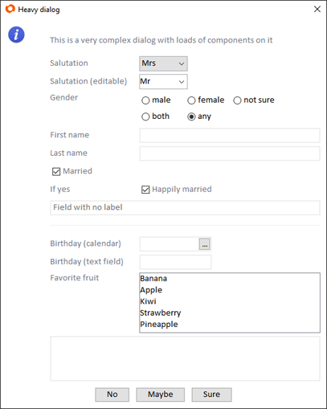

# Introduction
svyCustomDialogs is a helper scope to create simple dialogs on the fly. If you need a simple dialog to ask a user to change his password for example, svyCustomDialogs can create such a dialog with a few simple lines of code. It includes the functionality of Servoy's dialogs plugin or the mod_dialog from ServoyForge, which allows you to show dialogs with code continuation in the Servoy web client (your code will wait until the dialog is closed and not immediately run on).

Here is an example dialog created with svyCustomDialogs:



A dialog created by the scope consists of a simple two column layout, with labels in one column and fields in the other. A component without a label will span over both columns. 

# Creating Dialogs
To show a simple change password dialog, check out the following snippet:
```javascript
var customDialog = scopes.svyCustomDialogs.createCustomDialog(
		'myStyle',
		'Change password',
		'Please enter you current and a new password:',
		scopes.svyCustomDialogs.DEFAULT_ICON.INFO,
		['Cancel', 'OK']);
	
customDialog.addPasswordField('Current password:');
customDialog.addPasswordField('New password:');
customDialog.addPasswordField('New password repeat:');
	
customDialog.showDialog();
	
if (customDialog.buttonClickedText != 'OK') {
	return;
}
	
var result = customDialog.getResult();
	
application.output('Current password is ' + result[0]);
application.output('New password is ' + result[1]);
application.output('New password repeat is ' + result[2]);
```