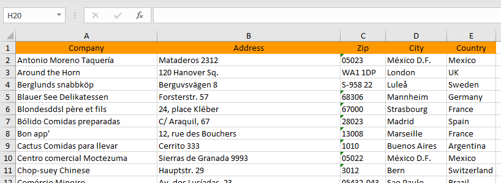

# Introduction
svyExcelUtils is a wrapper for Apache POI's excel library and allows to read and write xls and xlsx files directly from within Servoy.

# Installation
svyExcelUtils is dependent on some external libraries, some of which are already part of Servoy's Jasper plugin. So to use the functionality, you need to install at least the basic version of the Jasper plugin available here: https://www.servoyforge.net/projects/servoy-jasperreports/files

For support of xlsx and docx (as supported by svyWordUtils), **some additional libraries are required** that can be downloaded here: **[poi.zip](/Servoy/svyUtils/wiki/svyExcelUtils/plugins/poi.zip)**. Please place all files inside the archive in application_server/plugins/poi.

To let a smart client know it needs to download these libraries, some adjustments to the jnlp file of the Jasper plugin (application_server/plugins/servoy_jasperreports.jar.jnlp) need to be made:

#### Comment or remove poi-xxx.jar and xalan-xxx.jar

In the jnlp file you will find some entries like these

```xml
<jar href="/plugins/servoy_jasperreports/poi-3.10.1.jar" download="lazy" part="poi" version="3.10.1"/> 
   <package name="org.apache.poi.*" part="poi" recursive="true"/> 
<jar href="/plugins/servoy_jasperreports/xalan-2.7.1.jar" download="lazy" part="xalan" version="2.7.1"/> 
   <package name="org.apache.*" part="xalan" recursive="true"/> 
   <package name="java_cup.runtime.*" part="xalan" recursive="true"/>
```

Either remove or comment these lines out (by nesting them into a comment <!-- ... -->). To not run into **conflicts in developer, remove these two files** from application_server\plugins\servoy_jasperreports or rename them from *.jar to *.unused or whatever, so they don't get loaded by Servoy developer.

#### Add a few entries to the jnlp file

The following lines need to be added to the **<resources>** section of the jnlp file:

```xml
<!-- Files needed for Apache POI -->
<jar href="/plugins/poi/poi-3.14-20160307.jar" download="eager" version="%%version%%"/>
			
<!-- Files needed for xlsx and docx -->
<jar href="/plugins/poi/poi-ooxml-3.14-20160307.jar" download="eager" version="%%version%%"/>
<jar href="/plugins/poi/curvesapi-1.03.jar" download="eager" version="%%version%%"/>
<jar href="/plugins/poi/ooxml-schemas-1.3.jar" download="eager" version="%%version%%"/>
<jar href="/plugins/poi/xmlbeans-2.6.0.jar" download="eager" version="%%version%%"/>
    
<!-- Files needed for docx -->
<jar href="/plugins/poi/poi-scratchpad-3.14-20160307.jar" download="eager" version="%%version%%"/>
<jar href="/plugins/poi/xdocreport-1.0.4.jar" download="eager" version="%%version%%"/>
```

An example Jasper jnlp can be downloaded here: **[servoy_jasperreports.jar.jnlp](/Servoy/svyUtils/wiki/svyExcelUtils/plugins/servoy_jasperreports.jar.jnlp)**

You may sign the libraries in the poi directory just as you would sign any plugin. For convenience all these libraries are signed with Servoy's certificate. So if you do not sign the application server with your own certificate, you should not run into signature problems.

# Creating Excel files
Want to get started and do the reading later? Check out the following snippet:
```javascript
// Create workbook and sheet
var workbook = scopes.svyExcelUtils.createWorkbook(scopes.svyExcelUtils.FILE_FORMAT.XLSX);
var sheet = workbook.createSheet("Test");

// Create style for the header
var headerStyle = workbook.createCellStyle();
headerStyle
	.setFont("Arial,1,12")
	.setFillPattern(scopes.svyExcelUtils.FILL_PATTERN.SOLID_FOREGROUND)
	.setFillForegroundColor(scopes.svyExcelUtils.INDEXED_COLOR.LIGHT_ORANGE)
	.setAlignment(scopes.svyExcelUtils.ALIGNMENT.CENTER);

var rowNum = 1;

// Create header row and cells
var row = sheet.createRow(rowNum++);
var cell = row.createCell(1);
cell.setCellValue("Test 1", headerStyle);

cell = row.createCell(2);
cell.setCellValue("Test 2", headerStyle);

// Create some data and write to the sheet
var data = [[10, 35], [15, 47], [9, 22], [10, 33]];
for (var i = 0; i < data.length; i++) {
	row = sheet.createRow(rowNum++);
	row.createCell(1).setCellValue(data[i][0]);
	row.createCell(2).setCellValue(data[i][1]);
}

// Create a style for the sum
var sumStyle = workbook.createCellStyle();
// Clone the default font, so we won't be changing the default
var font = sumStyle.cloneFont();
font.underline = scopes.svyExcelUtils.FONT_UNDERLINE.DOUBLE_ACCOUNTING;
font.isBold = true;

// Create formula cells at the bottom
row = sheet.createRow(rowNum++);
cell = row.createCell(1);
cell.setCellStyle(sumStyle);
cell.setCellFormula("SUM(" + scopes.svyExcelUtils.getCellReferenceFromRange(2, 1 + data.length, 1, 1) + ")");

cell = row.createCell(2);
cell.setCellStyle(sumStyle);
cell.setCellFormula("SUM(" + scopes.svyExcelUtils.getCellReferenceFromRange(2, 1 + data.length, 2, 2) + ")");

// Write to file
var success = workbook.writeToFile("C:\\Temp\\test.xlsx");
```

The resulting xlsx file looks like this:


# Reading excel files
Typically, you want to access the data of an excel sheet. This code snippet shows how svyExcelUtils helps you with that (using the example xlsx file created above):

```javascript
//read workbook
var workbook = scopes.svyExcelUtils.getWorkbook('C:\\Temp\\test.xlsx');
//get sheet containing the data
var sheet = workbook.getSheet('Test');
//get the data from rows 1 to 5, column 1 and 2
var data = sheet.getSheetData(true, 1, 5, 1, 2);
//output result
application.output(data.getAsText('\t', '\n', '', true));
```

the output will look like this:

```
Test 1	Test 2
10.0	35.0
15.0	47.0
 9.0	22.0
10.0	33.0
```

# Creating Excel files from foundsets or datasets

svyExcelUtils also makes it easy to perform the probably most common task when dealing with Excel files: creating Excel from either a JSFoundSet or a JSDataSet:

```javascript
//create a dataset
var queryCustomers = datasources.db.example_data.customers.createSelect();
queryCustomers.result.add(queryCustomers.columns.companyname);
queryCustomers.result.add(queryCustomers.columns.address);
queryCustomers.result.add(queryCustomers.columns.postalcode);
queryCustomers.result.add(queryCustomers.columns.city);
queryCustomers.result.add(queryCustomers.columns.country);
var dsCustomers = databaseManager.getDataSetByQuery(queryCustomers, -1);
	
//create a xlsx workbook from the dataset, including all columns, using the given header names
var workbook = scopes.svyExcelUtils.createWorkbookFromDataSet(
	dsCustomers,
	null,
	['Company', 'Address', 'Zip', 'City', 'Country'], 
	scopes.svyExcelUtils.FILE_FORMAT.XLSX);
	
workbook.sheetName = 'All Customers';
	
//create styles for header and rows
var headerStyle = workbook.createHeaderStyle();
headerStyle
	.setFont('Calibri,0,11')
	.setFillPattern(scopes.svyExcelUtils.FILL_PATTERN.SOLID_FOREGROUND)
	.setFillForegroundColor(scopes.svyExcelUtils.INDEXED_COLOR.LIGHT_ORANGE)
	.setAlignment(scopes.svyExcelUtils.ALIGNMENT.CENTER);
workbook.headerStyle = headerStyle;
	
var rowStyle = workbook.createRowStyle();
rowStyle
	.setFont('Calibri,0,11');
workbook.rowStyle = rowStyle;
	
//write to file
workbook.writeToFile('C:\\Temp\\dataset.xlsx');
//or get the xlsx data
var bytes = workbook.getBytes();
```

The resulting xlsx file looks like this:

